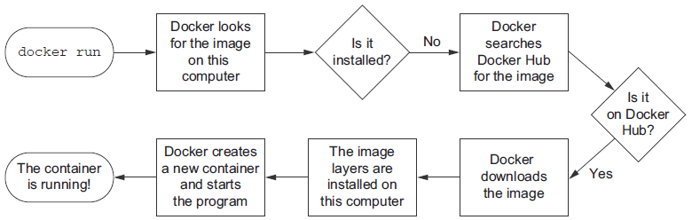
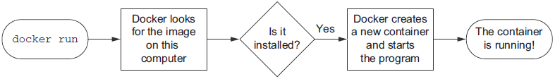
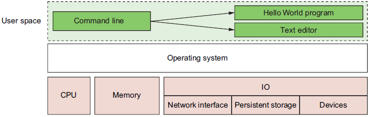
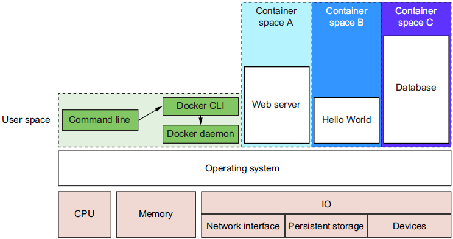
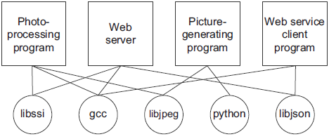
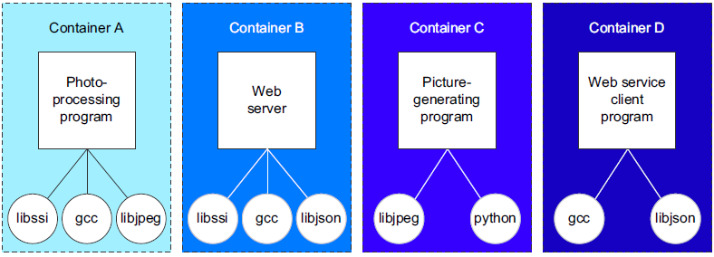
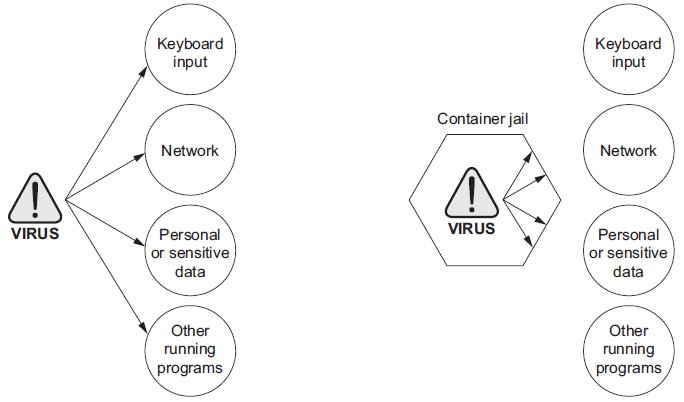

> dia001001<>yandex.ru / 123456

**Chapter 01 Welcome to Docker**

This chapter covers
- What Docker is
- Example: “Hello, World”
- An introduction to containers
- How Docker addresses software problems that most people tolerate
- When, where, and why you should use Docker
- Getting help

Best practice:
- Enhance security
- Prevent conflicts
- Improve serviceability
- Increase longevity


<!-- vim-markdown-toc GFM -->

* [What is Docker?](#what-is-docker)
    * ["Hello, World"](#hello-world)
    * [Containers](#containers)
    * [Containers are not virtualization](#containers-are-not-virtualization)
    * [Running software in containers for isolation](#running-software-in-containers-for-isolation)
    * [Shipping containers](#shipping-containers)
* [What problems does Docker solve?](#what-problems-does-docker-solve)
    * [Getting organized](#getting-organized)
    * [Improving portability](#improving-portability)
    * [Protecting your computer](#protecting-your-computer)
* [Why is Docker important?](#why-is-docker-important)
* [Where and when to use Docker](#where-and-when-to-use-docker)
* [Docker in the Larger Ecosystem](#docker-in-the-larger-ecosystem)
* [Getting help with the Docker command line](#getting-help-with-the-docker-command-line)
* [Summary](#summary)

<!-- vim-markdown-toc -->

# What is Docker?
## "Hello, World"
```
docker run dockerinaction/hello_world
```

**Figure 1.1** What happens after running `docker run`

<div align="center"">


</div>

**Figure 1.2** Running `docker run` a second time. Because the image is already installed, Docker can start the new container right away.

<div align="center"">


</div>

## Containers
With Docker, users get containers at a much lower cost. As Docker and its container engines improve, you get the latest and greatest isolation features. Instead of keeping up with the rapidly evolving and highly technical world of building strong containers, you can let Docker handle the bulk of that for you.

## Containers are not virtualization
## Running software in containers for isolation
**Figure** 1.3 A basic computer stack running two programs that were started from the command line

<div align="center"">


</div>

**Figure 1.4** Docker running three containers on a basic Linux computer system

<div align="center"">


</div>

Docker builds containers using ten major system features.
1. **_PID namespace_** — Process identifiers and capabilities
1. **_UTS namespace_** — Host and domain name
1. **_MNT namespace_** — File system access and structure
1. **_IPC namespace_** — Process communication over shared memory
1. **_NET namespace_** — Network access and structure
1. **_USR namespace_** — User names and identifiers
1. `chroot()` — Controls the location of the file system root
1. _cgroups_ — Resource protection
1. _CAP drop_ — Operating system feature restrictions
1. _Security Modules_ — Mandatory access controls

While Docker uses those to build containers at runtime, it uses another set of technologies to package and ship containers.

## Shipping containers
The component that fills the shipping container role is called an **image**.

# What problems does Docker solve?
Things are only made more complicated when applications share dependencies:
- What happens if one application needs an upgraded dependency but the other does not?
- What happens when you remove an application? Is it really gone?
- Can you remove old dependencies?
- Can you remember all the changes you had to make to install the software you now want to remove?

## Getting organized
**Figure 1.5** illustrates how example applications depend on example libraries without Docker.
<div align="center"">



</div>

**Figure 1.6** Example programs running inside containers with copies of their dependencies
<div align="center"">



</div>

## Improving portability
## Protecting your computer
There are all sorts of ways that a program might misbehave or present a security risk:
- A program might have been written specifically by an attacker.
- Well-meaning developers could write a program with harmful bugs.
- A program could accidentally do the bidding of an attacker through bugs in its input handling.


**Figure 1.7** Left: a malicious program with direct access to sensitive resources. Right: a malicious program inside a container.
<div align="center">


</div>

# Why is Docker important?
1. Docker is important because it makes containers available to everyone. Using it saves time, money, and energy.
1. The second reason Docker is important is that there is significant push in the software community to adopt containers and Docker.
1. The third reason Docker is important is that it has accomplished for the computer what app stores did for mobile devices.
1. Fourth, we’re finally starting to see better adoption of some of the more advanced isolation features of operating systems.

# Where and when to use Docker
# Docker in the Larger Ecosystem
# Getting help with the Docker command line
```
docker help
```

```
docker help cp
```

# Summary
