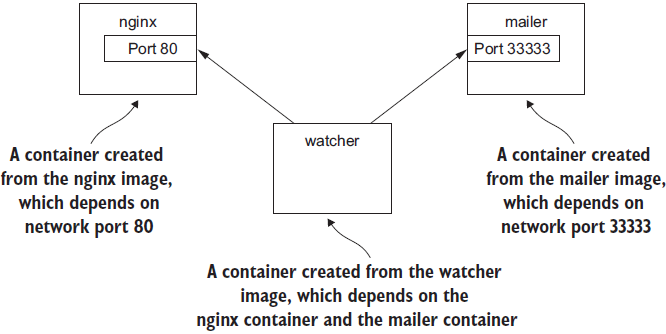
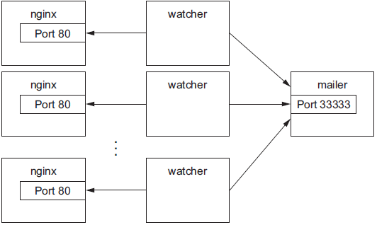
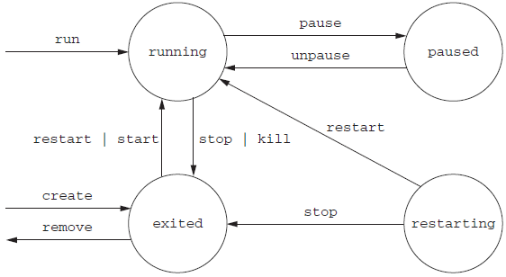
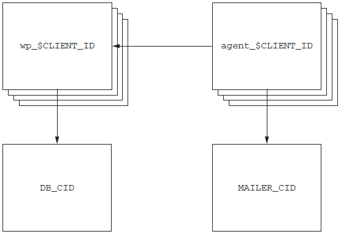

> dia001001<>yandex.ru / 123456
> e5591a65<>yandex.ru / 123456

> https://livebook.manning.com/#!/book/docker-in-action-second-edition/chapter-2

**Chapter 02 Running software in containers**

This chapter covers
- Running interactive and daemon terminal programs with containers
- Basic Docker operations and commands
- Containers and the PID namespace
- Container configuration and output
- Running multiple programs in a container
- Injecting configuration into containers
- Durable containers and the container life cycle
- Cleaning up

In this chapter, you’re going to install a web server called NGINX. Web servers are programs that make website files and programs accessible to web browsers over a network. You’re not going to build a website, but you are going to install and start a web server with Docker.

# Controlling containers: building a website monitor
**Figure 2.1** shows your planned architecture for the project.
<div align="center">


</div>

In this section you’ll learn how to do the following:
- Create detached and interactive containers
- List containers on your system
- View container logs
- Stop and restart containers
- Reattach a terminal to a container
- Detach from an attached container

## Creating and starting a new container
Running the following command will download, install, and start a container running NGINX:
```
docker run --detach --name web nginx:latest
```
The following command will install and run a mailer that will work for this example:
```
docker run -d \
    --name mailer \
    dockerinaction/ch2_mailer
```
The `--detach` flag or its short form `-d`.

## Running interactive containers
To get started working with interactive containers, run the following command:
```
docker run --interactive --tty \
    --link web:web \
    --name web_test \
    busybox:1.29 /bin/sh
```
From this shell you can run a command to verify that your web server is running correctly:
```
wget -O - http://web:80/
```

This command will start the agent in an interactive container using the short-form flags:
```
docker run -it \
    --name agent \
    --link web:insideweb \
    --link mailer:insidemailer \
    dockerinaction/ch2_agent
```

When running, the container will test the web container every second and print a message like the following:
```
System up.
```

Press *Ctrl + P + Q* can returne to the shell for your host computer.

## Listing, stopping, restarting, and viewing output of containers
The first thing you should do to test your current setup is check which containers are currently running by using the command:
```
docker ps
```
Running the command will display the following information about each running container:
- The container ID
- The image used
- The command executed in the container
- The time since the container was created
- The duration that the container has been running
- The network ports exposed by the container
- The name of the container

Restart containser:
```
docker restart web
docker restart mailer
docker restart agent
```

```
docker logs web
```
That should display a long log with several lines that contain this substring:
```
"GET / HTTP/1.0" 200
```
You can tell that the agent is monitoring the web server by examining the logs for web alone. For completeness you should examine the log output for mailer and agent as well:
```
docker logs mailer
docker logs agent
```
The logs for mailer should look something like this:
```
CH2 Example Mailer has started.
```

The logs for agent should contain several lines like the one you watched it write when you started the container:
```
System up.
```

> The docker logs command has a flag, `--follow` or `-f`, that will display the logs and then continue watching and updating the display with changes to the log as they occur. When you’ve finished, press Ctrl (or Command) and the C key to interrupt the `logs` command.

```
docker stop web
docker logs mailer
```
A line at the end of the mailer logs that reads like:
```
Sending email: To: admin@work  Message: The service is down!
```
That line means the agent successfully detected that the NGINX server in the container named web had stopped. Congratulations! Your client will be happy, and you’ve built your first real system with containers and Docker.

# Solved problems and the PID namespace
```
docker run -d --name namespaceA \
    busybox /bin/sh -c "sleep 30000"
docker run -d --name namespaceB \
    busybox /bin/sh -c "nc -l 0.0.0.0 -p 80"

docker exec namespaceA ps ①
docker exec namespaceB ps ②
```

Command ① above should generate a process list similar to the following:
```
PID   USER     TIME  COMMAND
  1   root     0:00  sleep 30000
  8   root     0:00  ps
```
Command ②  above should generate a slightly different process list:
```
PID   USER     TIME  COMMAND
  1   root     0:00  nc -l 0.0.0.0 -p 80
  9   root     0:00  ps
```
Try it yourself with a container running BusyBox Linux and the `ps` Linux command:
```
docker run --pid host busybox ps
```

You can see it in action by trying to run two copies of NGINX in the same container:
```
docker run –d --name webConflict nginx:latest
docker logs webConflict
docker exec webConflict nginx -g 'daemon off;'
```
The last command should display output like:
```
2019/04/12 12:04:35 [emerg] 10#0: bind() to 0.0.0.0:80 failed (98:
Address already in use)
nginx: [emerg] bind() to 0.0.0.0:80 failed (98: Address already in use)
...
```
The second process fails to start properly and reports that the address it needs is already in use. This is called a port conflict, and it’s a common issue in real-world systems where several processes are running on the same computer or multiple people contribute to the same environment. It’s a great example of a conflict problem that Docker simplifies and solves. Run each in a different container, like this:
```
docker run -d --name webA nginx:latest
docker logs webA
docker run -d --name webB nginx:latest
docker logs webB
```
Environment independence provides the freedom to configure software taking dependencies on scarce system resources without regard for other co-located software with conflicting requirements. Here are some common conflict problems:
- Two programs want to bind to the same network port.
- Two programs use the same temporary filename, and file locks are preventing that.
- Two programs want to use different versions of some globally installed library.
- Two processes want to use the same PID file.
- A second program you installed modified an environment variable that another program uses. Now the first program breaks.
- Multiple processes competing for memory or CPU time.

# Eliminating metaconflicts: building a website farm
**Figure 2.2** A fleet of web server containers and related monitoring agents
<div align="center">


</div>

One’s first instinct might be to simply start more web containers. That’s not as simple as it looks. Identifying containers gets complicated as the number of containers increases.

## Flexible container identification
```
docker run -d --name webid nginx

docker run -d --name webid nginx
```
The second command here will fail with a conflict error:
```
FATA[0000] Error response from daemon: Conflict. The name "webid" is
already in use by container 2b5958ba6a00. You have to delete (or rename)
that container to be able to reuse that name.
```
If a situation arises where the name of a container needs to change, you can always rename the container with the `docker` rename command:
```
docker rename webid webid-old
docker run -d --name webid nginx
```
In addition to the name, Docker assigns a unique identifier that was mentioned in the first example. These are hex-encoded 1024-bit numbers and look something like this:
```
7cb5d2b9a7eab87f07182b5bf58936c9947890995b1b94f412912fa822a9ecb5
```
When containers are started in detached mode, their identifier will be printed to the terminal. You can use these identifiers in place of the container name with any command that needs to identify a specific container. For example, you could use the previous ID with a `stop` or `exec` command:
```
docker exec \
    7cb5d2b9a7eab87f07182b5bf58936c9947890995b1b94f412912fa822a9ecb5 \
ps
 
docker stop \
    7cb5d2b9a7eab87f07182b5bf58936c9947890995b1b94f412912fa822a9ecb5
```

In most Docker interfaces, you’ll see container IDs truncated to their first 12 characters. This makes generated IDs a bit more user friendly. You can use them wherever a container identifier is required. So the previous two commands could be written like this:
```
docker exec 7cb5d2b9a7ea ps
docker stop 7cb5d2b9a7ea
```

You can use another command to create a container without starting it. The `docker create` command is very similar to docker run, the primary difference being that the container is created in a stopped state:
```
docker create nginx
```
The result should be a line like:
````
b26a631e536d3caae348e9fd36e7661254a11511eb2274fb55f9f7c788721b0d
````
If you’re using a Linux command shell like sh or bash, you can simply assign that result to a shell variable and use it again later:
```
CID=$(docker create nginx:latest)
echo $CID
```
Both the `docker run` and `docker create` commands provide another flag to write the ID of a new container to a known file:
```
docker create --cidfile /tmp/web.cid nginx

cat /tmp/web.cid
```
In other cases, you can use other commands like `docker ps` to get the ID of a container. For example, if you want to get the truncated ID of the last created container, you can use this:
```
CID=$(docker ps --latest --quiet)
echo $CID

CID=$(docker ps -l –q)
echo $CID
```
Container identification can be tricky, but you can manage the issue by using the ID and name-generation features of Docker.

## Container state and dependencies
With this new knowledge, the new system might looks something like this:
```
MAILER_CID=$(docker run -d dockerinaction/ch2_mailer)
WEB_CID=$(docker create nginx)
 
AGENT_CID=$(docker create --link $WEB_CID:insideweb \
    --link $MAILER_CID:insidemailer \
    dockerinaction/ch2_agent)
```

```
docker ps
docker ps -a
```
**Figure 2.3** The state transition diagram for Docker containers as reported by the status column

<div align="center">


</div>

In this example, the agent container has a dependency on the web container. You need to start the web container first:
```
docker start $WEB_CID
docker start $AGENT_CID
```

You can put everything together into one concise script that looks like:
```
MAILER_CID=$(docker run -d dockerinaction/ch2_mailer)
 
WEB_CID=$(docker run -d nginx)
 
AGENT_CID=$(docker run -d \
    --link $WEB_CID:insideweb \
    --link $MAILER_CID:insidemailer \
    dockerinaction/ch2_agent)
```

If you build systems or software that know too much about their environment—like addresses or fixed locations of dependency services—it’s difficult to change that environment or reuse the software. You need to deliver a system that minimizes environment dependence before the contract is complete.

# Building environment-agnostic systems
Docker has three specific features to help build environment-agnostic systems:
- Read-only file systems
- Environment variable injection
- Volumes

## Read-only file systems
Using read-only file systems accomplishes two positive things. 
1. You can have confidence that the container won’t be specialized from changes to the files it contains. 
1. You have increased confidence that an attacker can’t compromise files in the container.

To get started working on your client’s system, create and start a container from the WordPress image using the `--read-only` flag:
```
docker run -d --name wp --read-only \
    wordpress:5.0.0-php7.2-apache
```
The following command will print `true` if the container named wp is running and `false` otherwise.
```
docker inspect --format "{{.State.Running}}" wp
```
- The `docker inspect` command will display all the metadata (a JSON document) that Docker maintains for a container.
- The `--format` option transforms that metadata, and in this case, it filters everything except for the field indicating the running state of the container.
- This command should simply output `false`.

In this case, the container isn’t running. To determine why, examine the logs for the container:
```
docker logs wp
```

That command should output something like:
```
WordPress not found in /var/www/html - copying now...
Complete! WordPress has been successfully copied to /var/www/html
... skip output ...
Wed Dec 12 15:17:36 2018 (1): Fatal Error Unable to create lock file: Bad file descriptor (9)
```
Interesting, when running WordPress with a read-only filesystem, the Apache webserver process reports that it is unable to create a lock file.  Unfortunately, it does not report the location of the files it is trying to create.  If we have the locations, we can create exceptions for them.  Let’s run a WordPress container with a writable filesystem so that Apache is free to write where it wants:
```
docker run -d --name wp_writable wordpress:5.0.0-php7.2-apache
```

Now let’s check where Apache changed the container’s filesystem with the `docker diff` command:
```
docker container diff wp_writable
C /run
C /run/apache2
A /run/apache2/apache2.pid
```
For now, it’s sufficient to know that the output indicates that Apache created the `/run/apache2` directory and added the `apache2.pid` file inside of it.

Since this is an expected part of normal application operation, we will make an exception to the `read-only` filesystem. We will allow the container to write to `/run/apache2` using a writable volume mounted from the host.  We will also supply a temporary, in-memory, filesystem to the container at `/tmp` since Apache requires a writable temporary directory, as well:
```
docker run -d --name wp2 \
  --read-only \
  -v /run/apache2/ \
  --tmpfs /tmp \
  wordpress:5.0.0-php7.2-apache
```

That command should log successful messages that look like:
```
docker logs wp2
WordPress not found in /var/www/html - copying now...
Complete! WordPress has been successfully copied to /var/www/html
... skip output ...
[Wed Dec 12 16:25:40.776359 2018] [mpm_prefork:notice] [pid 1] AH00163: Apache/2.4.25 (Debian) PHP/7.2.13 configured -- resuming normal operations
[Wed Dec 12 16:25:40.776517 2018] [core:notice] [pid 1] AH00094: Command line: 'apache2 -D FOREGROUND'
```
WordPress also has a dependency on a MySQL database. A database is a program that stores data in such a way that it’s retrievable and searchable later. The good news is that you can install MySQL using Docker just like WordPress:
```
docker run -d --name wpdb \
    -e MYSQL_ROOT_PASSWORD=ch2demo \
    mysql:5.7
```
Once that is started, create a different WordPress container that’s linked to this new database container.
```
docker run -d --name wp3 \
    --link wpdb:mysql \
    -p 8000:80 \
    --read-only \
    -v /run/apache2/ \
    --tmpfs /tmp \
    wordpress:5.0.0-php7.2-apache
        #1   Use a unique name
        #2   Create a link to the database
        #3   Direct traffic from host port 8000 to container port 80
```
Check one more time that WordPress is running correctly:
```
docker inspect --format "{{.State.Running}}" wp3
```
The output should now be `true`.  If you would like to use your new WordPress installation, you can point a web browser to http://127.0.0.1:8000.

An updated version of the script you’ve been working on should look like this:
```
#!/bin/sh
 
DB_CID=$(docker create -e MYSQL_ROOT_PASSWORD=ch2demo mysql:5.7)
 
docker start $DB_CID
 
MAILER_CID=$(docker create dockerinaction/ch2_mailer)
docker start $MAILER_CID
 
WP_CID=$(docker create --link $DB_CID:mysql -p 80 \
    --read-only -v /run/apache2/ --tmpfs /tmp \
    wordpress:5.0.0-php7.2-apache)
 
docker start $WP_CID
 
AGENT_CID=$(docker create --link $WP_CID:insideweb \
    --link $MAILER_CID:insidemailer \
    dockerinaction/ch2_agent)
 
docker start $AGENT_CID
```

## Environment variable injection
The UNIX command `env` displays all the environment variables in the current execution context (your terminal). To see environment variable injection in action, use the following command:
```
docker run --env MY_ENVIRONMENT_VAR="this is a test" \
    busybox:1.29 \
    env
```
The `--env` flag, or `-e` for short, can be used to inject any environment variable. If the variable is already set by the image or Docker, then the value will be overridden. This way programs running inside containers can rely on the variables always being set. WordPress observes the following environment variables:
```
WORDPRESS_DB_HOST
WORDPRESS_DB_USER
WORDPRESS_DB_PASSWORD
WORDPRESS_DB_NAME
WORDPRESS_AUTH_KEY
WORDPRESS_SECURE_AUTH_KEY
WORDPRESS_LOGGED_IN_KEY
WORDPRESS_NONCE_KEY
WORDPRESS_AUTH_SALT
WORDPRESS_SECURE_AUTH_SALT
WORDPRESS_LOGGED_IN_SALT
WORDPRESS_NONCE_SALT
```

> **TIP** This example neglects the KEY and SALT variables, but any real production system should absolutely set these values.

```
docker create --env WORDPRESS_DB_HOST=<my database hostname> \
    wordpress: 5.0.0-php7.2-apache
```
```
docker create \
    --env WORDPRESS_DB_HOST=<my database hostname> \
    --env WORDPRESS_DB_USER=site_admin \
    --env WORDPRESS_DB_PASSWORD=MeowMix42 \
    wordpress:5.0.0-php7.2-apache
```
Using environment variable injection this way will help you separate the physical ties between a WordPress container and a MySQL container. Even in the case where you want to host the database and your customer WordPress sites all on the same machine, you’ll still need to fix the second problem mentioned earlier. All the sites are using the same default database name, which means different clients will be sharing a single database. You’ll need to use environment variable injection to set the database name for each independent site by specifying the `WORDPRESS_DB_NAME` variable:

```
docker create --link wpdb:mysql \
    -e WORDPRESS_DB_NAME=client_a_wp \
    wordpress:5.0.0-php7.2-apache
 
docker create --link wpdb:mysql \
    -e WORDPRESS_DB_NAME=client_b_wp \
    wordpress:5.0.0-php7.2-apache
```

Now that you understand how to inject configuration into the WordPress application and connect it to collaborating processes, let’s adapt the provisioning script.  First, let’s start database and mailer containers that will be shared by our clients and store the container ids in environment variables:
```
export DB_CID=$(docker run -d -e MYSQL_ROOT_PASSWORD=ch2demo mysql:5.7)
export MAILER_CID=$(docker run -d dockerinaction/ch2_mailer)
```
Now update the client site provisioning script to read the database container id, mailer container id, and a new `CLIENT_ID` from environment variables:
```
#!/bin/sh
 
if [ ! -n "$CLIENT_ID" ]; then
    echo "Client ID not set"
    exit 1
fi
 
WP_CID=$(docker create \
    --link $DB_CID:mysql \
    --name wp_$CLIENT_ID \
    -p 80 \
    --read-only -v /run/apache2/ --tmpfs /tmp \
    -e WORDPRESS_DB_NAME=$CLIENT_ID \
    --read-only wordpress:5.0.0-php7.2-apache)
 
docker start $WP_CID
 
AGENT_CID=$(docker create \
        --name agent_$CLIENT_ID \
    --link $WP_CID:insideweb \
    --link $MAILER_CID:insidemailer \
    dockerinaction/ch2_agent)
 
docker start $AGENT_CID
```
If you save this script to a file named `start-wp-for-client.sh`, you can provision WordPress for the `dockerinaction` client using a command like:
```
CLIENT_ID=dockerinaction ./start-wp-multiple-clients.sh
```
This new script will start an instance of WordPress and the monitoring agent for each customer and connect those containers to each other as well as a single mailer program and MySQL database. The WordPress containers can be destroyed, restarted, and upgraded without any worry about loss of data.

**Figure 2.4** Each WordPress and agent container uses the same database and mailer.

<div align="center">


</div>

# Building durable containers
When all the processes in a container have exited, that container will enter the exited state. Remember, a Docker container can be in one of four states:
- Running
- Paused
- Restarting
- Exited (also used if the container has never been started)

## Automatically restarting containers
Docker provides this functionality with a restart policy. Using the --restart flag at container-creation time, you can tell Docker to do any of the following:
- Never restart (default)
- Attempt to restart when a failure is detected
- Attempt for some predetermined time to restart when a failure is detected
- Always restart the container regardless of the condition

Docker doesn’t always attempt to immediately restart a container. Docker uses an exponential backoff strategy for timing restart attempts.
```
docker run -d --name backoff-detector --restart always busybox:1.29 date
```

Then after a few seconds use the trailing logs feature to watch it back off and restart:

```
docker logs -f backoff-detector
```

The only reason you might not want to adopt this directly is that during backoff periods, the container isn’t running. Containers waiting to be restarted are in the restarting state. To demonstrate, try to run another process in the backoff-detector container:
```
docker exec backoff-detector echo Just a Test
```

Running that command should result in an error message:
```
Cannot run exec command ... in container ...: No active container exists
with ID ...
```

That means you can’t do anything that requires the container to be in a running state, like execute additional commands in the container. That could be a problem if you need to run diagnostic programs in a broken container. A more complete strategy is to use containers that start lightweight init systems.

## PID 1 and init systems
An init system is a program that’s used to launch and maintain the state of other programs. Any process with PID 1 is treated like an init process by the Linux kernel (even if it is not technically an init system). In addition to other critical functions an init system starts other processes, restarts them in the event that they fail, transforms and forwards signals sent by the operating system, and prevents resource leaks. It is common practice to use real init systems inside containers when that container will run multiple processes or if the program being run uses child processes.

There are several such init systems that might be used inside a container. The most popular include `runit`, `Yelp/dumb-init`, `tini`, `supervisord`, and `tianon/gosu`. Publishing software that uses these programs is covered in chapter 8. For now, take a look at a container that uses `supervisord`.

Docker provides an image that contains a full LAMP (Linux, Apache, MySQL PHP) stack inside a single container. Containers created this way use `supervisord` to make sure that all the related processes are kept running. Start an example container:
```
docker run -d -p 80:80 --name lamp-test tutum/lamp
```
You can see what processes are running inside this container by using the `docker top` command:
```
docker top lamp-test
```
The top subcommand will show the host PID for each of the processes in the container. You’ll see `supervisord`, `mysql`, and `apache` included in the list of running programs. Now that the container is running, you can test the `supervisord` restart functionality by manually stopping one of the processes inside the container.
```
docker exec lamp-test ps
```

The process list generated will have listed `apache2` in the CMD column:
```
PID TTY          TIME CMD
  1 ?        00:00:00 supervisord
433 ?        00:00:00 mysqld_safe
835 ?        00:00:00 apache2
842 ?        00:00:00 ps
```
The values in the PID column will be different when you run the command. Find the PID on the row for `apache2` and then insert that for `<PID>` in the following command:
```
docker exec lamp-test kill <PID>
```
Running this command will run the Linux `kill` program inside the lamp-test container and tell the `apache2` process to shut down. When `apache2` stops, the `supervisord` process will log the event and restart the process. The container logs will clearly show these events:
```
...
... exited: apache2 (exit status 0; expected)
... spawned: 'apache2' with pid 820
... success: apache2 entered RUNNING state, process has stayed up for >
      than 1 seconds (startsecs)
```
A common alternative to the use of init systems is using a startup script that at least checks the preconditions for successfully starting the contained software. These are sometimes used as the default command for the container. For example, the WordPress containers that you’ve created start by running a script to validate and set default environment variables before starting the WordPress process. You can view this script by overriding the default command and using a command to view the contents of the startup script:
```
docker run wordpress:5.0.0-php7.2-apache cat /entrypoint.sh
```
Running that command will result in an error messages like:
```
error: missing WORDPRESS_DB_HOST and MYSQL_PORT_3306_TCP environment
variables
...
```
This failed because even though you set the command to run as `cat /entrypoint.sh`, Docker containers run something called an entrypoint before executing the command. Entrypoints are perfect places to put code that validates the preconditions of a container. Although this is discussed in depth in part 2 of this book, you need to know how to override or specifically set the entrypoint of a container on the command line. Try running the last command again but this time using the `--entrypoint` flag to specify the program to run and using the command section to pass arguments:

```
docker run --entrypoint="cat" \
    wordpress:5.0.0-php7.2-apache \
    /usr/local/bin/docker-entrypoint.sh
```
If you run through the displayed script, you’ll see how it validates the environment variables against the dependencies of the software and sets default values. Once the script has validated that WordPress can execute, it will start the requested or default command.

Startup scripts are an important part of building durable containers and can always be combined with Docker restart policies to take advantage of the strengths of each. Because both the MySQL and WordPress containers already use startup scripts, it’s appropriate to simply set the restart policy for each in an updated version of the example script.

Running startup scripts as PID 1 is problematic when the script fails to meet the expectations that Linux has for init systems. Depending on your use-case you might find that one approach or a hybrid works best.

With that final modification, you’ve built a complete WordPress site-provisioning system and learned the basics of container management with Docker. It has taken considerable experimentation. Your computer is likely littered with several containers that you no longer need. To reclaim the resources that those containers are using, you need to stop them and remove them from your system.

# Cleaning up
Ease of cleanup is one of the strongest reasons to use containers and Docker. The isolation that containers provide simplifies any steps that you’d have to take to stop processes and remove files. With Docker, the whole cleanup process is reduced to one of a few simple commands. In any cleanup task, you must first identify the container that you want to stop and/or remove. Remember, to list all of the containers on your computer, use the `docker ps` command:
```
docker ps -a
```
Because the containers you created for the examples in this chapter won’t be used again, you should be able to safely stop and remove all the listed containers. Make sure you pay attention to the containers you’re cleaning up if there are any that you created for your own activities.

All containers use hard drive space to store logs, container metadata, and files that have been written to the container file system. All containers also consume resources in the global namespace like container names and host port mappings. In most cases, containers that will no longer be used should be removed.

To remove a container from your computer, use the `docker rm` command. For example, to delete the stopped container named wp you’d run:
```
docker rm wp
```
You should go through all the containers in the list you generated by running `docker ps -a` and remove all containers that are in the exited state. If you try to remove a container that’s running, paused, or restarting, Docker will display a message like the following:
```
Error response from daemon: Conflict, You cannot remove a running container. Stop the container before attempting removal or use -f
FATA[0000] Error: failed to remove one or more containers
```
```
docker run --rm --name auto-exit-test busybox:1.29 echo Hello World
docker ps -a
```
```
docker container prune
```
```
docker rm -vf $(docker ps -a -q)
```

This concludes the basics of running software in containers. Each chapter in the remainder of part 1 will focus on a specific aspect of working with containers. The next chapter focuses on installing and uninstalling images, how images relate to containers, and working with container file systems.

# Summary
The primary focus of the Docker project is to enable users to run software in containers. This chapter shows how you can use Docker for that purpose. The ideas and features covered include the following:

- Containers can be run with virtual terminals attached to the user’s shell or in detached mode.
- By default, every Docker container has its own PID namespace, isolating process information for each container.
- Docker identifies every container by its generated container ID, abbreviated container ID, or its human-friendly name.
- All containers are in any one of four distinct states: running, paused, restarting, or exited.
- The `docker exec` command can be used to run additional processes inside a running container.
- A user can pass input or provide additional configuration to a process in a container by specifying environment variables at container-creation time.
- Using the `--read-only` flag at container-creation time will mount the container file system as read-only and prevent specialization of the container.
- A container restart policy, set with the `--restart` flag at container-creation time, will help your systems automatically recover in the event of a failure.
- Docker makes cleaning up containers with the `docker rm` command as simple as creating them.
