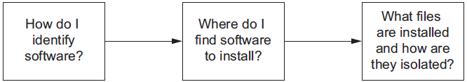

> a8899ee<>yandex.com / 123456

> https://livebook.manning.com/#!/book/docker-in-action-second-edition/chapter-3/v-4/1

**Chapter 03 Software installation simplified**

This chapter  covers:
- Identifying software
- Finding and installing software with Docker Hub
- Installing software from alternative sources
- Understanding file system isolation
- How images and layers work
- Benefits of images with layers

Chapters 1 and 2 introduce all-new concepts and abstractions provided by Docker. This chapter dives deeper into container file systems and software installation. It breaks down software installation into three steps, as illustrated in figure 3.1.

**Figure 3.1** Flow of topics covered in this chapter
<div align="center">


</div>

I’ve already mentioned that repositories hold images, but in this chapter I show how repositories and tags are used to identify images in order to install the software you want.

This chapter goes into detail on the three main ways to install Docker images:
- Docker registries
- Using image files with `docker save` and `docker load`
- Building images with Dockerfiles

**Layers** are an important concept when dealing with images and provide multiple important features. This chapter closes with a section about how images work. That knowledge will help you evaluate the image quality and establish a baseline skillset for part 2 of this book.


<!-- vim-markdown-toc GFM -->

* [Identifying software](#identifying-software)
    * [What is a named repository?](#what-is-a-named-repository)
    * [Using tags](#using-tags)
* [Finding and installing software](#finding-and-installing-software)
    * [Working with Docker registries from the command line](#working-with-docker-registries-from-the-command-line)
    * [Using alternative registries](#using-alternative-registries)
    * [Images as files](#images-as-files)
    * [Installing from a Dockerfile](#installing-from-a-dockerfile)
    * [Docker Hub from the website](#docker-hub-from-the-website)
* [Installation files and isolation](#installation-files-and-isolation)
    * [Image layers in action](#image-layers-in-action)
    * [Layer relationships](#layer-relationships)
    * [Container file system abstraction and isolation](#container-file-system-abstraction-and-isolation)
    * [Benefits of this toolset and file system structure](#benefits-of-this-toolset-and-file-system-structure)
    * [Weaknesses of union file systems](#weaknesses-of-union-file-systems)
    * [Summary](#summary)

<!-- vim-markdown-toc -->

# Identifying software
You would need a way to name the program, specify the version that you want to use, and specify the source that you want to install it from.

**Figure 3.2** Step 1—Software identification
<div align="center">


</div>

## What is a named repository?
A named repository is a named bucket of images. The name is similar to a URL. A repository’s name is made up of the name of the host where the image is located, the user account that owns the image, and a short name. For example, later in this chapter you will install an image from the repository named registry.dockerinaction.com/dockerinaction/ch3_hello_registry.
<div align="center">


</div>

## Using tags
Tags are both an important way to uniquely identify an image and a convenient way to create useful aliases. Whereas a tag can only be applied to a single image in a repository, a single image can have several tags. This allows repository owners to create useful versioning or feature tags.

For example, the Java repository on Docker Hub maintains the following tags: 7, 7-jdk, 7u71, 7u71-jdk, openjdk-7, and openjdk-7u71. All these tags are applied to the same image. But as the current minor version of Java 7 increases, and they release 7u72, the 7u71 tag will likely go away and be replaced with 7u72. If you care about what minor version of Java 7 you’re running, you have to keep up with those tag changes. If you just want to make sure you’re always running the most recent version of Java 7, just use the image tagged with 7. It will always be assigned to the newest minor revision of Java 7. These tags give users great flexibility.

It’s also common to see different tags for images with different software configurations. For example, I’ve released two images for an open source program called freegeoip. It’s a web application that can be used to get the rough geographical location associated with a network address. One image is configured to use the default configuration for the software. It’s meant to run by itself with a direct link to the world. The second is configured to run behind a web load balancer. Each image has a distinct tag that allows the user to easily identify the image with the features required.
# Finding and installing software
You can identify software by a repository name, but how do you find the repositories that you want to install? Discovering trustworthy software is complex, and it is the second step in learning how to install software with Docker.
**Figure 3.3** Step 2—Locating repositories
<div align="center">


</div>
When you issue a `docker pull` or `docker run` command without specifying an alternative registry, Docker will default to looking for the repository on Docker Hub. Docker Hub makes Docker more useful out of the box.
## Working with Docker registries from the command line
There are two ways that an image author can publish their images to a registry like Docker Hub:
- Use the command line to push images that they built independently and on their own systems.
- Make a Dockerfile publicly available and use a continuous build system to publish images. Dockerfiles are scripts for building images. Images created from these automated builds are preferred because the Dockerfile is available for examination prior to installing the image.

```
docker login
docker logout
```

## Using alternative registries
Using an alternative registry is simple. It requires no additional configuration. All you need is the address of the registry. The following command will download another “Hello World” type example from an alternative registry:
```
docker pull registry.dockerinaction.com/ch3/hello_registry:latest
```
The registry address is part of the full repository specification covered in section 3.1. The full pattern is as follows:
```
[REGISTRYHOST:PORT/][USERNAME/]NAME[:TAG]
```
Docker knows how to talk to Docker registries, so the only difference is that you specify the registry host. In some cases, working with registries will require an authentication step. If you encounter a situation where this is the case, consult the documentation or the group that configured the registry to find out more. When you’re finished with the hello-registry image you installed, remove it with the following command:
```
docker rmi registry.dockerinaction.com/ch3/hello_registry
```
Registries are powerful. They enable a user to relinquish control of image storage and transportation. But running your own registry can be complicated and may create a potential single point of failure for your deployment infrastructure. If running a custom registry sounds a bit complicated for your use case, and third-party distribution tools are out of the question, you might consider loading images directly from a file.

## Images as files
Docker provides a command to load images into Docker from a file. With this tool, you can load images that you acquired through other channels. Maybe your company has chosen to distribute images through a central file server or some type of version-control system. Maybe the image is small enough that your friend just sent it to you over email or shared it via flash drive. However you came upon the file, you can load it into Docker with the `docker load` command.

**Figure 3.4** Parts of the pull and save subcommands
<div align="center">


</div>
I used the .tar filename suffix in this example because the `docker save` command creates TAR archive files. You can use any filename you want. If you omit the `–o` flag, the resulting file will be streamed to the terminal.

```
docker rmi busybox
docker load –i myfile.tar
```

## Installing from a Dockerfile
```
git clone https://github.com/dockerinaction/ch3_dockerfile.git
docker build -t dia_ch3/dockerfile:latest ch3_dockerfile
```
When you’re finished with this example, make sure to clean up your workspace:
```
docker rmi dia_ch3/dockerfile
rm -rf ch3_dockerfile
```
## Docker Hub from the website
If you have yet to stumble upon it while browsing docker.com, you should take a moment to check out https://hub.docker.com. Docker Hub lets you search for repositories, organizations, or specific users. User and organization profile pages list the repositories that the account maintains, recent activity on the account, and the repositories that the account has starred. On repository pages you can see the following:
- General information about the image provided by the image publisher
- A list of the tags available in the repository
- The date the repository was created
- The number of times it has been downloaded
- Comments from registered users
```
docker run -it --rm dockerinaction/ch3_ex2_hunt
```
```
docker rmi dockerinaction/ch3_ex2_hunt
docker rmi <mystery repository>
```

**Figure 3.5** The steps required to complete the Docker Hub scavenger hunt. Find the mystery repository on Docker Hub. Install the latest image from that repository and run it interactively to get the password.

<div align="center">


</div>

There are three other ways to install software:
- You can use alternative repository registries or run your own registry.
- You can manually load images from a file.
- You can download a project from some other source and build an image using a provided Dockerfile.

# Installation files and isolation
If you understand what files are actually installed and how those files are built and isolated at runtime, you’ll be able to answer more difficult questions that come up with experience, such as these:
- What image properties factor into download and installation speeds?
- What are all these unnamed images that are listed when I use the `docker images` command?
- Why does output from the `docker pull` command include messages about pulling dependent layers?
- Where are the files that I wrote to my container’s file system?


**Figure 3.6** Step 3—Understanding how software is installed

<div align="center">


</div>

## Image layers in action
```
docker pull dockerinaction/ch3_myapp
docker pull dockerinaction/ch3_myotherapp
```
If you run `docker images` now, you’ll see the following repositories listed:
- `dockerinaction/ch3_myapp`
- `dockerinaction/ch3_myotherapp`
- `java:6`

```
docker rmi \
    dockerinaction/ch3_myapp \
    dockerinaction/ch3_myotherapp \
    java:6
```

## Layer relationships
Images maintain parent/child relationships. In these relationships they build from their parents and form layers. The files available to a container are the union of all of the layers in the lineage of the image the container was created from. Images can have relationships with any other image, including images in different repositories with different owners. The two images in section 3.3.1 use a Java 6 image as their parent. Figure 3.7 illustrates the full image ancestry of both images.

**Figure 3.7** The full lineage of the two Docker images used in section 3.3.1

<div align="center">


</div>

## Container file system abstraction and isolation
Programs running inside containers know nothing about image layers. From inside a container, the file system operates as though it’s not running in a container or operating on an image. From the perspective of the container, it has exclusive copies of the files provided by the image. This is made possible with something called a union file system. Docker uses a variety of union file systems and will select the best fit for your system. The details of how the union file system works are beyond what you need to know to use Docker effectively.

A union file system is part of a critical set of tools that combine to create effective file system isolation. The other tools are MNT namespaces and the `chroot` system call.

The file system is used to create mount points on your host’s file system that abstract the use of layers. The layers created are what are bundled into Docker image layers. Likewise, when a Docker image is installed, its layers are unpacked and appropriately configured for use by the specific file system provider chosen for your system.

The Linux kernel provides a namespace for the MNT system. When Docker creates a container, that new container will have its own MNT namespace, and a new mount point will be created for the container to the image.

Lastly, `chroot` is used to make the root of the image file system the root in the container’s context. This prevents anything running inside the container from referencing any other part of the host file system.

Using `chroot` and MNT namespaces is common for container technologies. By adding a union file system to the recipe, Docker containers have several benefits.

## Benefits of this toolset and file system structure
The first and perhaps most important benefit of this approach is that common layers need to be installed only once. If you install any number of images and they all depend on some common layer, that common layer and all of its parent layers will need to be downloaded or installed only once. This means you might be able to install several specializations of a program without storing redundant files on your computer or downloading redundant layers. By contrast, most virtual machine technologies will store the same files as many times as you have redundant virtual machines on a computer.

Second, layers provide a coarse tool for managing dependencies and separating concerns. This is especially handy for software authors, and chapter 7 talks more about this. From a user perspective, this benefit will help you quickly identify what software you’re running by examining which images and layers you’re using.

Lastly, it’s easy to create software specializations when you can layer minor changes on top of some basic image. That’s another subject covered in detail in chapter 7. Providing specialized images helps users get exactly what they need from software with minimal customization. This is one of the best reasons to use Docker.

## Weaknesses of union file systems
Docker selects sensible defaults when it is started, but no implementation is perfect for every workload. In fact, there are some specific use cases when you should pause and consider using another Docker feature.

Different file systems have different rules about file attributes, sizes, names, and characters. Union file systems are in a position where they often need to translate between the rules of different file systems. In the best cases they’re able to provide acceptable translations. In the worst cases features are omitted. For example, neither btrfs nor OverlayFS provides support for the extended attributes that make SELinux work.

Union file systems use a pattern called copy-on-write, and that makes implementing memory-mapped files (the mmap() system call) difficult. Some union file systems provide implementations that work under the right conditions, but it may be a better idea to avoid memory-mapping files from an image.

The backing file system is another pluggable feature of Docker. You can determine which file system your installation is using with the `info` subcommand. If you want to specifically tell Docker which file system to use, do so with the `--storage-driver` or `-s` option when you start the Docker daemon. Most issues that arise with writing to the union file system can be addressed without changing the storage provider. These can be solved with volumes, the subject of chapter 4.

## Summary
The task of installing and managing software on a computer presents a unique set of challenges. This chapter explains how you can use Docker to address them. The core ideas and features covered by this chapter are as follows:

- Human Docker users use repository names to communicate which software they would like Docker to install.
- Docker Hub is the default Docker registry. You can find software on Docker Hub through either the website or the `docker` command-line program.
- The `docker` command-line program makes it simple to install software that’s distributed through alternative registries or in other forms.
- The image repository specification includes a registry host field.
- The `docker load` and `docker save` commands can be used to load and save images from TAR archives.
- Distributing a Dockerfile with a project simplifies image builds on user machines.
- Images are usually related to other images in parent/child relationships. These relationships form layers. When we say that we have installed an image, we are saying that we have installed a target image and each image layer in its lineage.
- Structuring images with layers enables layer reuse and saves bandwidth during distribution and storage space onError! Bookmark not defined. your Error! Bookmark not defined.computer.
