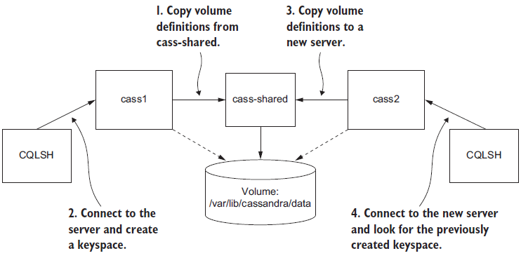

> yyuuaavv@yandex.com / 123456

> https://livebook.manning.com/#!/book/docker-in-action-second-edition/chapter-4/v-5/1

**Chapter 04 Working with storage and volumes**


This chapter covers:
- Introducing mount points
- How to share data between the host and a container
- How to share data between containers
- Manipulating container mount points
- Bind mounts
- Temporary file system mounts
- Managing data with volumes
- Advanced storage with volume plugins


Consider what it might look like to run a database program inside a container. You would package the software with the image, and when you start the container it might initialize an empty database. When programs connect to the database and enter data, where is that data stored? Is it in a file inside the container? What happens to that data when you stop the container or remove it? How would you move your data if you wanted to upgrade the database program? What happens to that storage on a cloud machine when it is terminated?


<!-- vim-markdown-toc GFM -->

* [File trees and mount points](#file-trees-and-mount-points)
* [Bind mounts](#bind-mounts)
* [In-memory storage](#in-memory-storage)
* [Docker volumes](#docker-volumes)
    * [Volumes provide container-independent data management](#volumes-provide-container-independent-data-management)
    * [Using volumes with a NoSQL database](#using-volumes-with-a-nosql-database)
* [Shared mount points and sharing files](#shared-mount-points-and-sharing-files)
    * [Anonymous volumes and the volumes-from flag](#anonymous-volumes-and-the-volumes-from-flag)
* [Cleaning up volumes](#cleaning-up-volumes)
* [Advanced storage with volume plugins](#advanced-storage-with-volume-plugins)
* [Summary](#summary)

<!-- vim-markdown-toc -->

# File trees and mount points
The rest of this chapter elaborates on how to manage storage and the mount points in containers. The best place to start is by understanding the three most common types of storage mounted into containers:

1. Bind mounts
1. In-memory storage
1. Docker volumes

All three types of mount points can be created using the `--mount` flag on the `docker run` and `docker create` subcommands.

# Bind mounts

**Figure 4.1** A host directory as a bind mount volume

<div align="center">


</div>


You can try this for yourself. Create a placeholder log file and create a special nginx configuration file named `example.conf`. Run the following commands to create and populate the files:
```
touch ~/example.log
 cat >~/example.conf <<EOF
 server {
   listen 80;
   server_name localhost;
   access_log /var/log/nginx/custom.host.access.log main;
   location / {
     root /usr/share/nginx/html;
     index index.html index.htm;
   }
 }
 EOF
```

Once a server is started with this configuration file it will offer the nginx default site at http://localhost/ and access logs for that site will be written to a file in the container at /var/log/nginx/custom.host.access.log. The following command will start an nginx HTTP server in a container where your new configuration is bind mounted to the server’s configuration root:
```
CONF_SRC=~/example.conf; \ CONF_DST=/etc/nginx/conf.d/default.conf; \
LOG_SRC=~/example.log; \ LOG_DST=/var/log/nginx/custom.host.access.log; \ docker run -d --name diaweb \
  --mount type=bind,src=${CONF_SRC},dst=${CONF_DST} \
   --mount type=bind,src=${LOG_SRC},dst=${LOG_DST} \
   -p 80:80 \
   nginx:latest
```

With this container running, you should be able to point your web browser at http://localhost/ and see the nginx hello-world page, and you will not see any access logs in the container log stream: `docker logs diaweb`. However you will be able to see those logs if you examine the `example.log` file in your home directory: cat `~/example.log`.

In this example you used the `--mount` option with the `type=bind` option. The other two mount parameters, src and dst define the source location on the host file tree and the destination location on the container file tree. You must specify locations with absolute paths, but in this example we used shell expansion and shell variables to make the command easier to read.

```
docker rm -f diaweb
  
 >CONF_SRC=~/example.conf; \
 CONF_DST=/etc/nginx/conf.d/default.conf; \
 LOG_SRC=~/example.log; \
 LOG_DST=/var/log/nginx/custom.host.access.log; \
 docker run -d --name diaweb \
   --mount type=bind,src=${CONF_SRC},dst=${CONF_DST},readonly=true \
   --mount type=bind,src=${LOG_SRC},dst=${LOG_DST} \
   -p 80:80 \
   nginx:latest
```

By creating the read-only mount you can prevent any process inside the container from modifying the content of the volume. You can see this in action by running a quick test:
```
docker exec diaweb \
     sed -i "s/listen 80/listen 8080/" /etc/nginx/conf.d/default.conf
```

This command executes a sed command inside the diaweb container and attempts to modify the configuration file. The command fails because the file is mounted as read-only.
1. The first problem with bind mounts is that they tie otherwise portable container descriptions to the file system of a specific host. If a container description depends on content at a specific location on the host file system, then that description isn’t portable to hosts where the content is unavailable or available in some other location.
1. The next big problem is that they create an opportunity for conflict with other containers. It would be a bad idea to start multiple instances of Cassandra that all use the same host location as a bind mount for data storage. In that case, each of the instances would compete for the same set of files. Without other tools such as file locks, that would likely result in corruption of the database.

# In-memory storage
Most service software and web applications have use private key files, database passwords, API key files or other sensitive configuration files, and need upload buffering space. In these cases it is important that you never include those type of files in an image or write them to disk. Instead you should use in-memory storage. You can add in-memory storage to containers with a special type of mount.

Set the type option on the mount flag to `tmpfs`. This is the easiest way to mount memory based files system into a container’s file tree. Consider the command:
```
docker run --rm \
     --mount type=tmpfs,dst=/tmp \
     --entrypoint mount \
     alpine:latest -v
```

This command creates an empty tmpfs device and attaches it to the new container’s file tree at /tmp. Any files created under this file tree will be written to memory instead of disk. More than that, the mount point is created with sensible defaults for generic workloads. Running the command will display a list of all the mount points for the container. The list will include the following line:
```
tmpfs on /tmp type tmpfs (rw,nosuid,nodev,noexec,relatime)
```

This line describes the mount point configuration. From left-to-right it indicates that:
1. a tmpfs device is mounted to the tree at /tmp
1. that the device has a tmpfs file system
1. the tree is read/write capable
1. suid bits will be ignored on all files in this tree
1. no files in this tree will be interpreted as special devices
1. no files in this tree will be executable
1. file access times will be updated if they are older than the current modify or change time

```
docker run --rm \
     --mount type=tmpfs,dst=/tmp,tmpfs-size=16k,tmpfs-mode=1770 \
     --entrypoint mount \
     alpine:latest -v
```

# Docker volumes
Docker volumes are named file system trees managed by Docker. They can be implemented with disk storage on the host file system, or another more exotic backend like cloud storage. All operations on Docker volumes can be accomplished using the `docker volume` subcommand set. Using volumes is a method of decoupling storage from specialized locations on the file system that you might specify with bind mounts.

You can create and inspect volumes using the `docker volume create` and `docker volume inspect` subcommands. By default Docker creates volumes using the local volume plugin. The default behavior will create a directory to store the contents of a volume somewhere in a part of the host file system under control of the Docker engine. For example the following two commands will create a volume named, “location-example” and display the location of the volume host file system tree:
```
docker volume create \
     --driver local \
     --label example=location \
     location-example
 docker volume inspect \
     --format "{{json .Mountpoint}}" \
     location-example
```

## Volumes provide container-independent data management
Semantically, a volume is a tool for segmenting and sharing data that has a scope or life cycle that’s independent of a single container. That makes volumes an important part of any containerized system design that shares or writes files. Examples of data that differs in scope or access from a container include the following:

- Database software versus database data
- Web application versus log data
- Data processing application versus input and output data
- Web server versus static content
- Products versus support tools

## Using volumes with a NoSQL database
```
docker volume create \
     --driver local \
     --label example=cassandra \
     cass-shared
```
```
docker run -d \
     --mount cass-shared:/var/lib/cassandra/data \
     --name cass1 \
     cassandra:2.2
```
```
docker run –it --rm \
     --link cass1:cass \
     cassandra:2.2 cqlsh cass
```
Now you can inspect or modify your Cassandra database from the CQLSH command line. First, look for a keyspace named docker_hello_world:
```
select *
 from system.schema_keyspaces
 where keyspace_name = 'docker_hello_world';
```


Cassandra should return an empty list. This means the database hasn’t been modified by the example. Next, create that keyspace with the following command:
```
create keyspace docker_hello_world
 with replication = {
     'class' : 'SimpleStrategy',
     'replication_factor': 1
 };
```

```
select *
 from system.schema_keyspaces
 where keyspace_name = 'docker_hello_world';
```

This time Cassandra should return a single entry with the properties you specified when you created the keyspace. If you’re satisfied that you’ve connected to and modified your Cassandra node, quit the CQLSH program to stop the client container:
```
# Leave and stop the current container
quit
```
```
docker stop cass1
docker rm -vf cass1
```

**Figure 4.2** Key steps in creating and recovering data persisted to a volume with Cassandra

<div align="center">


</div>


The next three commands will test recovery of the data:
```
docker run -d \
     --mount cass-shared:/var/lib/cassandra/data \
     --name cass2 \
     cassandra:2.2
  
 docker run –it --rm \
     --link cass2:cass \
     cassandra:2.2 \
     cqlsh cass
  
 select *
 from system.schema_keyspaces
 where keyspace_name = 'docker_hello_world';
```

```
quit
  
 docker rm -vf cass2 cass-shared
```

# Shared mount points and sharing files
Sharing access to the same set of files between multiple containers is where the value of volumes becomes most obvious. Compare the bind mount and volume based approaches.

Bind mounts are the most obvious way to share some disk space between containers. You can see it in action in the following example:
```
LOG_SRC=~/web-logs-example
 mkdir ${LOG_SRC}
  
 docker run --name plath -d \
     --mount type=bind,src=${LOG_SRC},dst=/data \
     registry.dockerinaction.com/ch4/writer_a
  
 docker run --rm \
     --mount type=bind,src=${LOG_SRC},dst=/data \
     alpine:latest \
     head /data/logA
  
 cat ${LOG_SRC}/logA
  
 docker rm -f plath
```

Now compare that bind mount example with an example that uses volumes. The following commands are equivalent to the prior example but have no host-specific dependencies.
```
docker volume create \
     --driver local \
     logging-example
  
 docker run --name plath -d \
     --mount type=volume,src=logging-example,dst=/data \
     registry.dockerinaction.com/ch4/writer_a
  
 docker run --rm \
     --mount type=bind,src=logging-example,dst=/data \
     alpine:latest \
     head /data/logA
  
 cat "$(docker volume inspect \
     --format "{{json .Mountpoint}}" logging-example)"/logA
  
 docker stop plath
```

## Anonymous volumes and the volumes-from flag
An anonymous volume is created without a name either before use with the `docker volume create` subcommand, or just-in-time with defaults using a `docker run` or `docker create` command. When the volume is created it will be assigned a unique identifier like, “1b3364a8debb5f653d1ecb9b190000622549ee2f812a4fb4ec8a83c43d87531b” instead of a human friendly name. These are more difficult to work with if you are stitching together dependencies manually, but they are useful when you need to eliminate potential volume naming conflicts. The docker command line provides another way to specify mount dependencies instead of referencing volumes by name.

The `docker run` command provides a flag, `--volumes-from` that will copy the mount definitions from one or more containers to the new container. It can be set multiple times to specify multiple source containers. By combining this flag and anonymous volumes you can build rich shared-state relationships in a host-independent way. Consider the following example:

```
docker run --name fowler \
     --mount type=volume,dst=/library/PoEAA \
     --mount type=bind,src=/tmp,dst=/library/DSL \
     alpine:latest \
     echo "Fowler collection created."
 docker run --name knuth \
     --mount type=volume,dst=/library/TAoCP.vol1 \
     --mount type=volume,dst=/library/TAoCP.vol2 \
     --mount type=volume,dst=/library/TAoCP.vol3 \
     --mount type=volume,dst=/library/TAoCP.vol4.a \
     alpine:latest \
     echo "Knuth collection created"
  
 docker run --name reader \
     --volumes-from fowler \
     --volumes-from knuth \
     alpine:latest ls -l /library/
  
 docker inspect --format "{{json .Mounts}}" reader
```
```
docker run --name aggregator \
     --volumes-from fowler \
     --volumes-from knuth \
     alpine:latest \
     echo "Collection Created."
  
 docker run --rm \
     --volumes-from aggregator \
     alpine:latest \
     ls -l /library/
```
```
docker run --name chomsky --volume /library/ss \
     alpine:latest echo "Chomsky collection created."
 docker run --name lamport --volume /library/ss \
     alpine:latest echo "Lamport collection created."
  
 docker run --name student \
     --volumes-from chomsky --volumes-from lamport \
     alpine:latest ls -l /library/
  
 docker inspect -f "{{json .Mounts}}" student
```

# Cleaning up volumes
```
docker volume create --driver=local
 # Outputs:
 # 462d0bb7970e47512cd5ebbbb283ed53d5f674b9069b013019ff18ccee37d75d
  
 docker volume remove \    
     462d0bb7970e47512cd5ebbbb283ed53d5f674b9069b013019ff18ccee37d75d
 # Outputs:
 # 462d0bb7970e47512cd5ebbbb283ed53d5f674b9069b013019ff18ccee37d75d
```
```
for i in amazon google microsoft; \
 do \
 docker run --rm \
     --mount type=volume,src=$i,dst=/tmp \
     --entrypoint /bin/sh \
     alpine:latest -c "nslookup $i.com > /tmp/results.txt"; \
 done
```
```
docker volume remove \
     amazon google microsoft
```
```
docker volume prune --filter example=cassandra
```
```
docker volume prune --filter example=location --force
```

# Advanced storage with volume plugins
Docker provides a volume plugin interface as a means for the community to extend the default engine capabilities. That has been implemented by several storage management tools, and today users are free to leverage all types of backing storage including proprietary cloud block storage, network file system mounts, specialized storage hardware, on-prem cloud solutions like Ceph and vSphere storage.

These community and vendor plugins will help you solve the hard problems associated with writing files to disk on one machine and depending on them from another. They are simple to install, configure, and remove using the appropriate `docker plugin` subcommands.

Docker plugins are not covered in detail in this text. They are always environment specific and difficult to demonstrate without using paid resources or endorsing specific cloud providers. Choosing a plugin depends on the storage infrastructure you want to integrate with, however there are a few projects that simplify this to some degree. Rexray (https://github.com/rexray/rexray)  is a popular open source project that provides volumes on several cloud and on-prem storage platforms. If you’ve come to the point in your container journey that you need more sophisticated volume backends you should look at the latest offerings on Docker Hub and look into the current status of Rexray.

# Summary
One of the first major hurdles in learning how to use Docker is understanding how to work with files that are not part of images and might be shared with other containers or the host. This chapter covers mount points depth, including the following:

- Mount points allow many file systems from many devices to be attached to a single file tree. Every container has its own file tree.
- Containers can use bind mounts to attach parts of the host file system into a container.
- In-memory file systems can be attached to a container file tree so sensitive or temporary data is not written to disk.
- Docker provides anonymous or named storage references called volumes.
- Volumes can be created, listed, and deleted using the appropriate docker volume subcommand.
- Volumes are parts of the host file system that Docker mounts into containers at specified locations.
- Volumes have life cycles of their own and might need to be periodically cleaned up.
- Docker can provide volumes backed by network storage or other more sophisticated tools if the appropriate volume plugin is installed.
