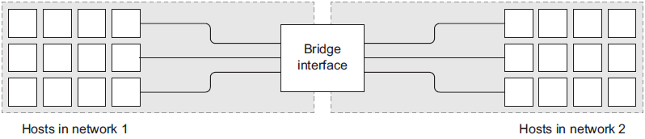

**Chapter 05 Single Host Networking**

> jgtydabj【】sharklasers.com

**This chapter covers**
- Networking background
- Creating Docker container networks
- Network-less and host-mode containers
- Publishing services on the ingress network
- Container network caveats

# 5.1 Networking background (for beginners)
## 5.1.1   Basics: protocols, interfaces, and ports


## 5.1.2   Bigger picture: networks, NAT, and port forwarding

The figure illustrates the described route and draws the relationships between physical message routing and network routing.


A bridge interface connecting two distinct networks



This has been a very rough introduction to some nuanced topics. This has only scratched the surface in order to help you understand how to use Docker and the networking facilities that it simplifies.

# 5.2   Docker container networking
Docker abstracts the underlying host-attached network from containers.

Docker also treats networks as first-class entities. This means that they have their own life cycle and are not bound to any other objects. You can define and manage them directly using the `docker network` subcommands.

Running `docker network ls` will print a table of all the networks to the terminal. The resulting table should look like this:

```
NETWORK ID          NAME                DRIVER              SCOPE
63d93214524b        bridge              bridge              local
6eeb489baff0        host                host                local
3254d02034ed        none                null                local
```

By default Docker includes three networks where each is provided by a different driver. 

The network named:

1. “**bridge**” is the default network and provided by a “bridge” driver. The bridge driver provides inter-container connectivity for all containers running on the same machine.
1. “**host**” network is provided by the “host” driver, which instructs Docker not to create any special networking namespace or resources for attached containers. Containers on the “host” network interact with the host’s network stack like uncontained processes.
1. “**none**” network uses the “null” driver. Containers attached to the “none” network will not have any network connectivity outside of themselves.

The “scope” of a network can take three values, __*local*__, __*global*__ or __*swarm*__.

## 5.2.1   Creating a user-defined bridge network

Follow figure illustrates two containers attached to a bridge network and its components.


Build a new network with a single command:
```
docker network create \
   --driver bridge \
   --label project=dockerinaction \
   --label chapter=5 \
   --attachable \
   --scope local \
   --subnet 10.0.42.0/24 \
   --ip-range 10.0.42.128/25 \
   user-network
```

This command creates a new local bridge network named, "user-network." Adding label metadata to the network will help in identifying the resource later. Marking the new network as "attachable" allows you to attach and detach containers to the network at any time. Here you’ve manually specified the network scope property and set it to the default value for this driver. Finally, a custom subnet and assignable address range was defined for this network, "10.0.42.0/24" assigning from the upper-half of the last octet (10.0.42.128/25).  This means that as you add containers to this network they will receive IP addresses in the range from 10.0.42.128 to 10.0.42.255.

## 5.2.2   Exploring a bridge network

Start exploring your new bridge network by creating a new container attached to that network:
```
docker run -it \
   --network user-network \
   --name network-explorer \
   alpine:3.8 \
     sh
```

Get a list of the IPv4 addresses available in the container from your terminal (which is now attached to the running container) by running the following:

```
ip -f inet -4 -o addr
```

The results should look something like this:

```
1: lo    inet 127.0.0.1/8 scope host lo\ ...
18: eth0    inet 10.0.42.129/24 brd 10.0.42.255 scope global eth0\ ...
```

Next, create another bridge network and attach your running network-explorer container to both networks. First, detach your terminal from the running container (press control and P and Q) then create the second bridge network:

```
docker network create \
   --driver bridge \
   --label project=dockerinaction \
   --label chapter=5 \
   --attachable \
   --scope local \
   --subnet 10.0.43.0/24 \
   --ip-range 10.0.43.128/25 \
   user-network2
```

Once the second network has been created you can attach the network-explorer container (still running):

```
docker network connect \
   user-network2 \
   network-explorer
```
After the container has been attached to the second network, reattach your terminal to continue your exploration:

```
docker attach network-explorer
```

Now back in the container examining the network interface configuration again will show something like:

```
1: lo    inet 127.0.0.1/8 scope host lo\ ...
18: eth0    inet 10.0.42.129/24 brd 10.0.42.255 scope global eth0\ ...
20: eth1    inet 10.0.43.129/24 brd 10.0.43.255 scope global eth1\ ...
```
As you might expect, this output shows that the network-explorer container is attached to both user-defined bridge networks.


Install the nmap package inside your running container using this command:
```
apk update && apk add nmap
```

Nmap is a powerful network inspection tool that can be used to scan network address ranges for running machines, fingerprint those machines, and determine what services they are running. For our purposes we simply want to determine what other containers or other network devices are available on our bridge network. Run the following command to scan the 10.0.42.0/24 subnet that we defined for our bridge network:

```
nmap -sn 10.0.42.* -sn 10.0.43.* -oG /dev/stdout | grep Status
```
The command should output something like this:

```
Host: 10.0.42.128 ()    Status: Up
 Host: 10.0.42.129 (7c2c161261cb)        Status: Up
 Host: 10.0.43.128 ()    Status: Up
 Host: 10.0.43.129 (7c2c161261cb)        Status: Up
```
This shows that there are only two devices attached to each of the bridge networks: the gateway adapters created by the bridge network driver and the currently running container. Create another container on one of the two bridge networks for more interesting results.

Detach from the terminal again (control + P and Q) and start another container attached to user-network2. Run:

```
docker run -d \
   --name lighthouse \
   --network user-network2 \
   alpine:3.8 \
     sleep 1d
```
After the lighthouse container has started reattach to your network-explorer container:

```
docker attach network-explorer
```
And from the shell in that container run the network scan again. The results show that the "lighthouse" container is up and running, and accessible from the "network-explorer" container via its attachment to "user-network2." The output should be similar to this:

```
Host: 10.0.42.128 ()    Status: Up
 Host: 10.0.42.129 (7c2c161261cb)        Status: Up
 Host: 10.0.43.128 ()    Status: Up
 Host: 10.0.43.130 (lighthouse.user-network2)    Status: Up
 Host: 10.0.43.129 (7c2c161261cb)        Status: Up
```

## 5.2.3   Beyond bridge networks
# 5.3   Special container networks: host and none
```
docker run --rm \
     --network host \
     alpine:3.8 ip -o addr
```

You can verify this by inspecting the network configuration yourself. Run the following command to list the available interfaces inside a container on the none network:

```
docker run --rm \
     --network none \
     alpine:3.8 ip -o addr
```

Running this example, you can see that the only network interface available is the loopback interface, bound to the address 127.0.0.1. This configuration means three things:

- Any program running in the container can connect to or wait for connections on that interface.
- Nothing outside the container can connect to that interface.
- No program running inside that container can reach anything outside the container.

That last point is important and easily demonstrable. If you’re connected to the internet, try to reach a popular service that should always be available. In this case, try to reach CloudFlare’s public DNS service:

```
docker run --rm \
     --network none \
     alpine:3.8 \
     ping -w 2 1.1.1.1
```

In this example you create a network isolated container and try to test the speed between your container and the public DNS server provided by CloudFlare. This attempt should fail with a message like “ping: send-to: Network is unreachable.” This makes sense because we know that the container has no route to the larger network.

# 5.4   Handling inbound traffic with NodePort publishing
# 5.5   Container Networking Caveats and Customizations
## 5.5.1   No firewalls or network policies
## 5.5.2   Custom DNS configuration
## 5.5.3   Externalizing network management
# 5.6   Summary
